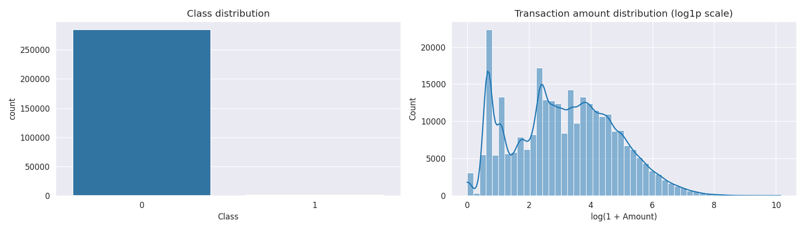
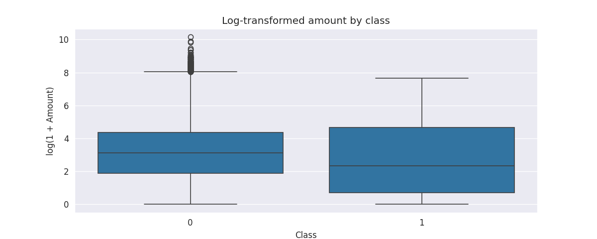
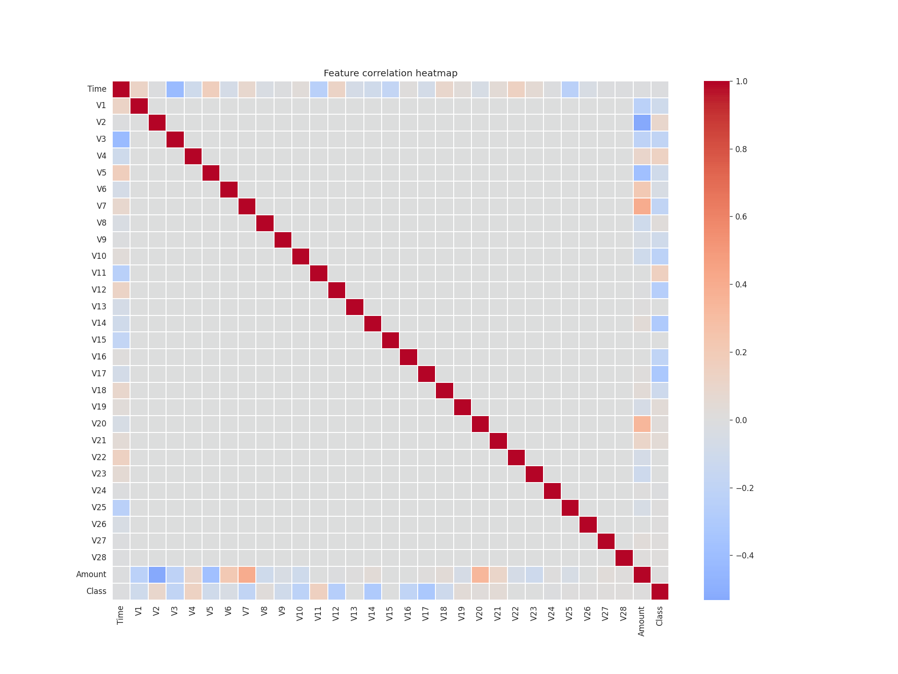
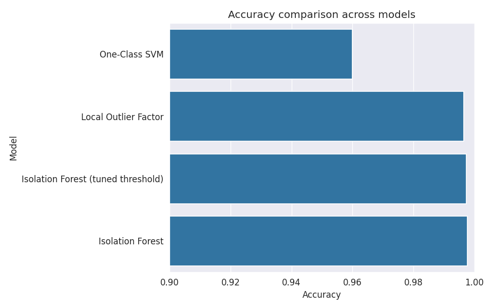
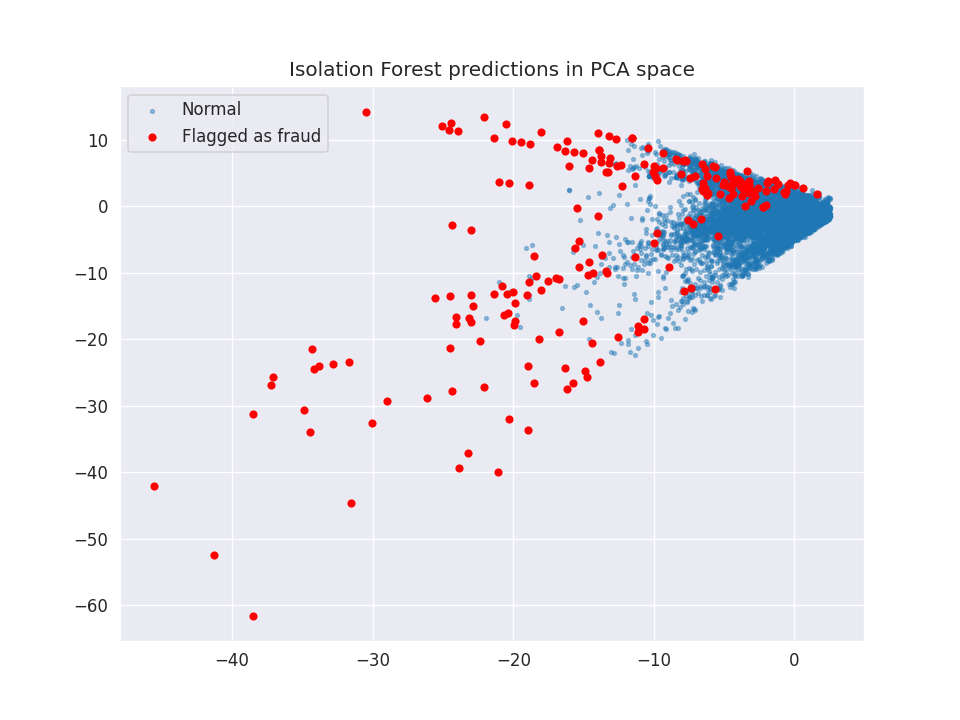

# Credit Card Fraud Detection

Anomaly detection on the [Kaggle credit card fraud dataset](https://www.kaggle.com/mlg-ulb/creditcardfraud) — 284,807 transactions, 492 labeled as fraud (~0.17%). Three unsupervised models are trained and compared without ever showing them fraud labels during training, since that's the realistic setting for fraud detection: new fraud patterns rarely look like anything in a labeled training set.

## Table of Contents
- [Overview](#overview)
- [Dataset](#dataset)
- [Assumptions](#assumptions)
- [Methodology](#methodology)
- [Results](#results)
- [Key Insights](#key-insights)
- [Project Structure](#project-structure)
- [Setup & Usage](#setup--usage)
- [Tech Stack](#tech-stack)
- [Future Improvements](#future-improvements)

## Overview

Credit card fraud is a classic extreme-imbalance problem — fraud makes up less than 0.2% of transactions, so a model that never flags anything is already 99.8% "accurate" while being completely useless. This project treats fraud detection as an **anomaly detection** task instead of standard classification: models learn what normal transactions look like and flag anything that deviates significantly, rather than learning to separate two balanced classes.

## Dataset

| | |
|---|---|
| Source | [mlg-ulb/creditcardfraud](https://www.kaggle.com/mlg-ulb/creditcardfraud) on Kaggle |
| Transactions | 284,807 |
| Fraud cases | 492 (0.173%) |
| Normal cases | 284,315 (99.827%) |
| Imbalance ratio | 1 : 578 |
| Features | `Time`, `V1`–`V28` (PCA-anonymized), `Amount`, `Class` |

The `V1`–`V28` features are the output of a PCA transformation applied by the dataset's original authors to anonymize the underlying transaction details, so they carry signal but aren't individually interpretable.

## Assumptions

- Dataset is downloaded automatically via `kagglehub`, so no manual file placement is needed.
- Since the point of unsupervised anomaly detection is to not rely on labels for training, models are fit on the training split without using `y_train` — labels are used only for evaluation.
- Contamination rate for Isolation Forest / LOF / One-Class SVM is estimated from the known fraud ratio in the training split (0.173%).
- One-Class SVM is trained on a normal-only sample of 8,000 rows since it scales poorly (O(n²)–O(n³)) on 200k+ rows.

## Methodology

**1. Exploratory Data Analysis**
Examined class imbalance, transaction amount distribution, and feature correlations before modeling. Since `Amount` is heavily right-skewed (most transactions are under $1,000, with a long tail of large outliers), a `log1p` transform was applied for visualization so the distribution isn't crushed into a single bar.

**2. Preprocessing**
`Amount` and `Time` were standardized with `StandardScaler`; the PCA features (`V1`–`V28`) were left as-is since they're already normalized by construction. Data was split 70/30 with stratification to preserve the fraud ratio in both sets.

**3. Modeling**
Three unsupervised algorithms were trained and evaluated on the same test split:
- **Isolation Forest** — isolates anomalies by how few random splits it takes to separate a point from the rest of the data
- **Local Outlier Factor (LOF)** — flags points with much lower local density than their neighbors
- **One-Class SVM** — learns a decision boundary around normal data in a kernel-transformed space

**4. Threshold Tuning**
Isolation Forest's default `predict()` uses a fixed contamination-based cutoff. To see if that cutoff was optimal, a precision-recall curve was computed over the raw anomaly scores, and the threshold maximizing F1-score was selected instead.

**5. Evaluation**
Accuracy, precision, recall, F1-score, and confusion matrices for all models; ROC-AUC for the score-based Isolation Forest; and a PCA projection of the test set to visually inspect which transactions got flagged.

## Results

### Class Imbalance & Amount Distribution



The dataset's imbalance is stark — fraud is barely visible on a linear count plot. The log-transformed amount distribution (right) shows most transactions cluster well under $100, with a long tail that a linear-scale histogram would otherwise compress into a single bar.

### Transaction Amount by Class



On a log scale, fraudulent transactions show a noticeably different amount profile than normal ones — a wider spread and a higher median in this dataset — which is part of why `Amount` carries some predictive signal despite not being the dominant feature.

### Feature Correlation Heatmap



Since `V1`–`V28` are PCA components, they're uncorrelated with each other by construction (hence the clean diagonal). `Amount` and `Class` are the only features with any meaningful correlation structure against the PCA components.

### Model Performance

| Model | Accuracy | Fraud Precision | Fraud Recall | Fraud F1 |
|---|---|---|---|---|
| **Isolation Forest** | **99.77%** | 0.34 | 0.31 | 0.32 |
| Isolation Forest (tuned threshold) | 99.73% | 0.31 | 0.45 | 0.37 |
| Local Outlier Factor | 99.66% | 0.00 | 0.00 | 0.00 |
| One-Class SVM | 96.00% | 0.03 | 0.83 | 0.07 |

*ROC-AUC (Isolation Forest, score-based): 0.9443*



Accuracy alone is misleading here — a model that predicts "normal" for everything would already score 99.8%. The precision/recall/F1 columns matter far more for judging real fraud-catching ability, which is why the raw accuracy bar chart looks deceptively flat despite very different underlying behavior between models.

### Isolation Forest: Flagged Transactions in PCA Space



Projecting the test set onto its top 2 principal components shows that flagged transactions (red) cluster along the sparser edges of the data cloud — consistent with how Isolation Forest works, since points that are easy to isolate with few splits tend to sit in low-density regions.

## Key Insights

- **Isolation Forest was the strongest performer**, both on raw accuracy (99.77%) and on the F1/ROC-AUC front (0.9443 AUC) — it handled the extreme imbalance far better than the other two methods.
- **Local Outlier Factor essentially failed on this dataset** (0/148 frauds caught) — its density-based approach struggles when fraud isn't necessarily in a low-density region relative to *local* neighbors, especially in high-dimensional PCA space.
- **One-Class SVM caught the most fraud by recall (83%) but at a steep precision cost** (only 3% of its fraud flags were correct) — it over-flags aggressively, which would overwhelm a real fraud review team with false positives.
- **Threshold tuning meaningfully improved Isolation Forest's fraud recall** (31% → 45%) at a small accuracy cost (99.77% → 99.73%), showing the default `contamination`-based cutoff wasn't F1-optimal.
- **Accuracy is a poor headline metric for this problem.** All four models score above 96% accuracy purely because of the class imbalance; the real differentiator is precision/recall trade-off on the fraud class.

## Project Structure

```
.
├── Fraud_Detection.ipynb       # Main notebook: EDA, modeling, evaluation
├── class_distribution.png      # Class imbalance + amount distribution plots
├── amount_by_class.png         # Log-transformed amount by class
├── correlation_heatmap.png     # Feature correlation heatmap
├── model_comparison.png        # Accuracy bar chart across models
├── model_comparison.csv        # Raw accuracy numbers per model
├── pca_predictions.png         # PCA projection of flagged transactions
├── .env.example                # Template for Kaggle API credentials
├── .gitignore                  # Excludes .env and cache files
└── README.md
```

## Setup & Usage

**1. Clone the repo and install dependencies**
```bash
git clone <your-repo-url>
cd credit-card-fraud-detection
pip install pandas numpy scikit-learn matplotlib seaborn kagglehub python-dotenv
```

**2. Set up Kaggle credentials**

Copy `.env.example` to `.env` and fill in your [Kaggle API credentials](https://www.kaggle.com/settings) (Account → API → Create New Token):
```
KAGGLE_USERNAME=your_username
KAGGLE_KEY=your_key
```
`.env` is gitignored, so your credentials never get committed.

**3. Run the notebook**

Open `Fraud_Detection.ipynb` and run all cells. The dataset downloads automatically via `kagglehub` on first run and is cached locally afterward.

## Tech Stack

- **Python 3.12**
- **pandas / numpy** — data manipulation
- **scikit-learn** — `IsolationForest`, `LocalOutlierFactor`, `OneClassSVM`, `StandardScaler`, `PCA`, metrics
- **matplotlib / seaborn** — visualization
- **kagglehub** — automated dataset download
- **python-dotenv** — credential management

## Future Improvements

- Try **autoencoder-based** anomaly detection to compare a deep-learning approach against the classical models here
- Add **SMOTE or other oversampling** as a supervised-learning baseline (e.g. XGBoost with class weighting) to contrast against the unsupervised approach
- Deploy the tuned Isolation Forest behind a lightweight **API endpoint** for real-time scoring
- Experiment with **feature engineering on `Time`** (e.g. hour-of-day) since fraud patterns often have temporal structure that raw seconds-since-start doesn't capture well
